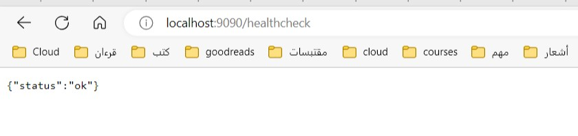
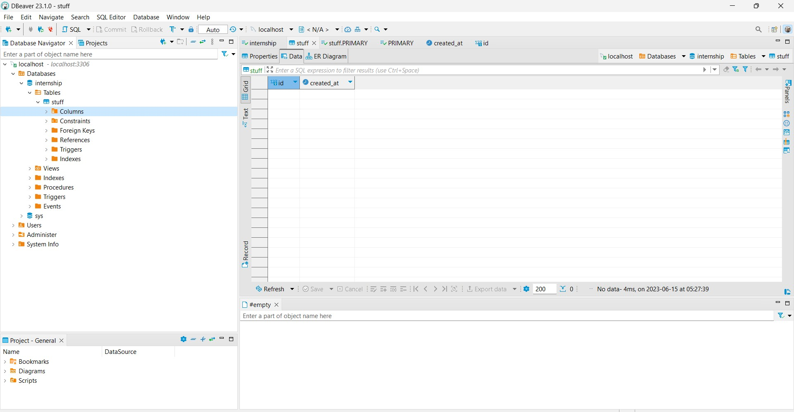
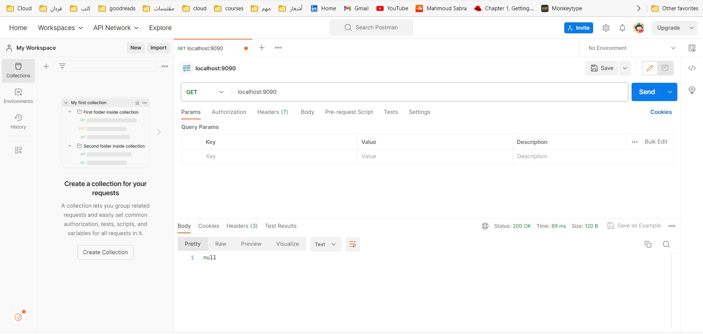
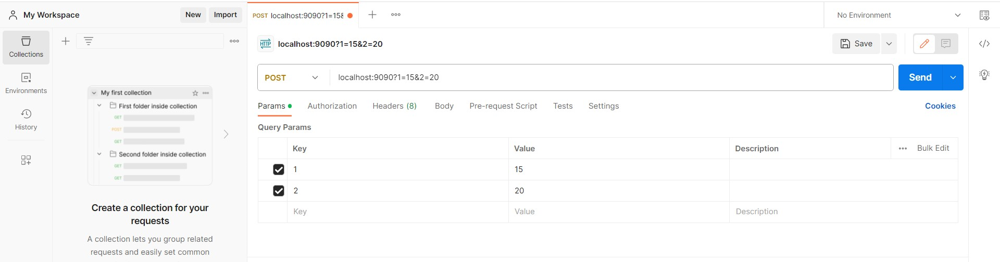
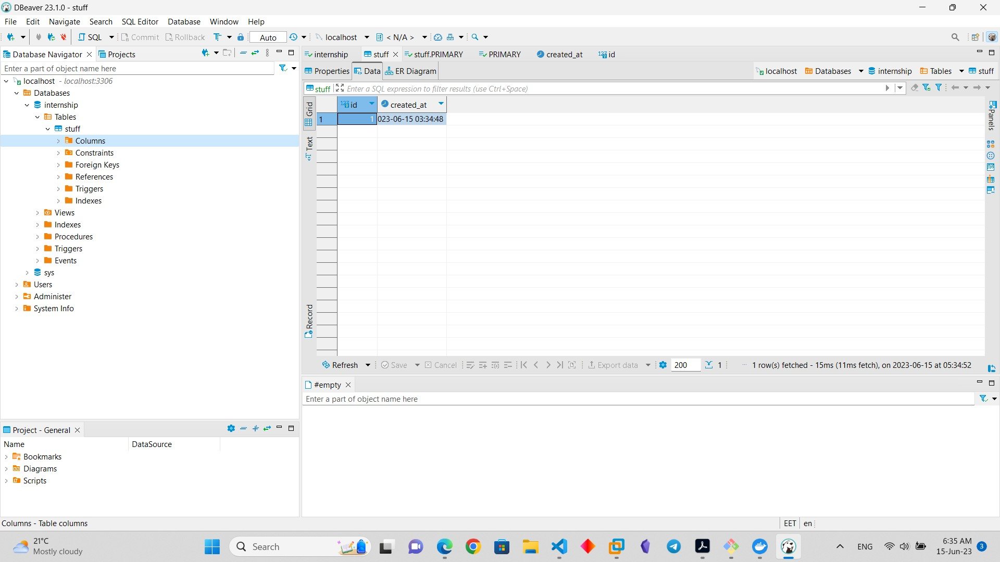
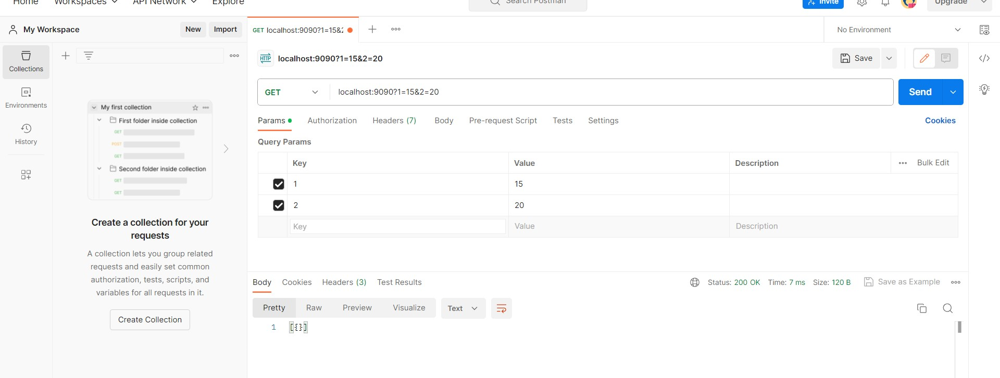
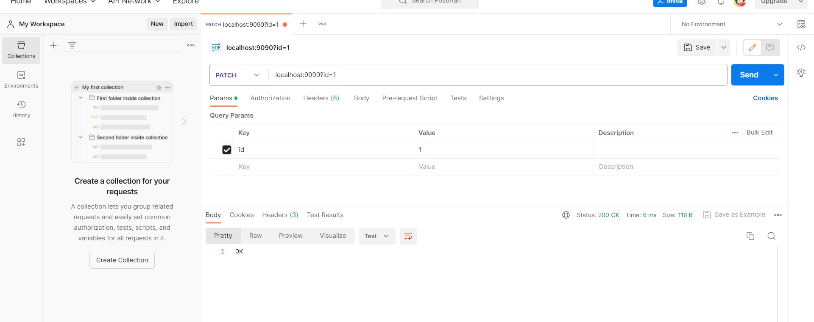
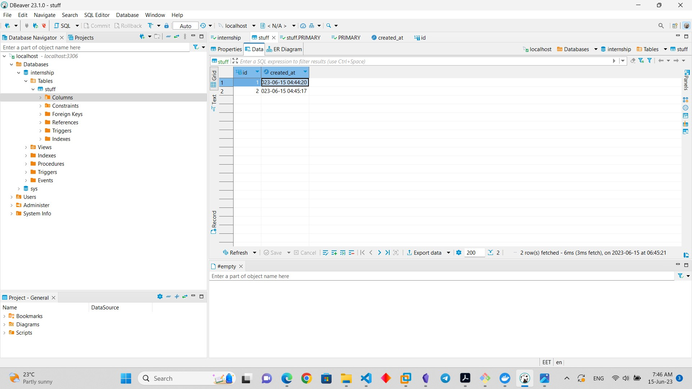
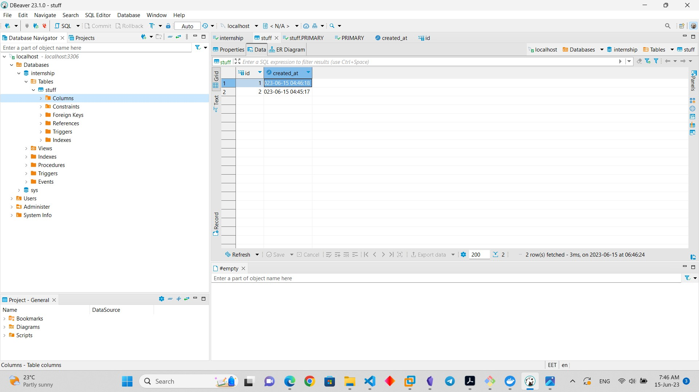

# Table of content
-----
1. Information about App.
2. Docker 
3. CI/CD (Pipeline with jenkins)
4. Testing API
5. Future updating
-----
## Information about App.

This program is very simple, it connects to a MySQL database based on the following env vars:
* MYSQL_HOST
* MYSQL_USER
* MYSQL_PASS
* MYSQL_PORT

And exposes itself on port 9090:
* On `/healthcheck` it returns an OK message, 
* On GET it returns all recorded rows.
* On POST it creates a new row.
* On PATCH it updates the creation date of the row with the same ID as the one specified in query parameter `id`
_______
## Docker 
> My Dockerfile consists of two stages and is used to build a Go application and create a minimal runtime image.

### Stage 1: Build stage

- Base image: golang:1.20-alpine
- Sets the working directory inside the container to /app
- Copies the Go project files to the container's working directory
- Builds the Go binary using the command go build -o app

### Stage 2: Create a minimal runtime image

- Base image: scratch (an empty, minimal image)
- Copies the built binary from the previous stage (/app/app) to the container's /app/app path
- Sets the working directory inside the container to /app
- Exposes port 9090 on which the application will listen
- Defines the command to run the Go binary as the entrypoint for the container using CMD ["./app"]
### Docker-Compose 
> My Docker Compose file describes the configuration for a Docker Compose environment consisting of two services: "app" and "db" 
So building Docker-compose.yaml to check correct running locally
- Using `Browser` to test api
- Using `dbeaver` to test DB

## Summary 
My Dockerfile follows a multi-stage approach to optimize the resulting image size. In the first stage, i used the golang:1.20-alpine image as the base to build the Go binary. Then, in the second stage, i createsd a minimal runtime image using the scratch base image and only includes the built binary. This approach helps reduce the final image size by excluding unnecessary dependencies and files.
And The Docker Compose file is used to define and configure the services required for a complete environment consisting of a Go application ("app" service) and a MySQL database ("db" service).
----
## CI/CD 
Using Jenkins to build docker image and login to dockerhub then push it with specific tag
here is a link to docker image https://hub.docker.com/r/ma7moudsabra/instabugtask
----
## Testing API
Using Postman to Testing  API.
- First On GET it returns all recorded rows.
- Null refers to empty rows.

- Second On Post it creates a new row

- when we Get again 

- Third On Patch it updates the row 

  before 
  
  After 
  
---
## Future updating
I will use Helm manifests for kubernetes to deploy the app using them on kubernetes with adding config to support high availability and volume persistence and exposing service to the public (you can use minikube to test). 

